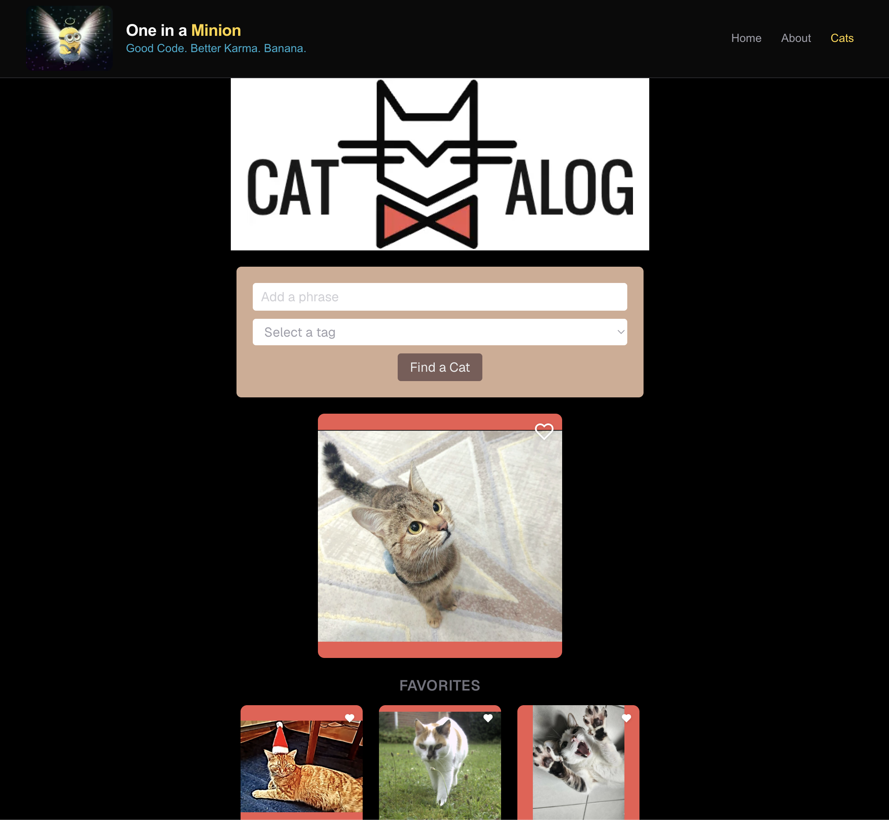

# I need an Angle

My Dad loved minions, this is a site themed around them. I wanted to get familiar with the [Next.js](https://nextjs.org) app structure and [Tailwind CSS](https://tailwindcss.com), so I build out the base of this project adding styling and Despicable content.

## Description

Browse the Despicable Me / Minions poster slider, pick a poster, and read up on the film it belongs to.



## Getting Started

This project uses Node `22.13.0` (see `.nvmrc`). If you use [nvm](https://github.com/nvm-sh/nvm), run `nvm use` to pick up the right version automatically.

```bash
yarn install
yarn dev
```

Open [http://localhost:3000](http://localhost:3000) to see it running.

## Scripts

| Command             | What it does                              |
| ------------------- | ----------------------------------------- |
| `yarn dev`          | Starts the dev server                     |
| `yarn build`        | Production build                          |
| `yarn start`        | Runs the production build                 |
| `yarn lint`         | Runs ESLint                               |
| `yarn format`       | Formats the codebase with Prettier        |
| `yarn format:check` | Checks formatting without writing changes |
| `yarn test`         | Runs the Jest test suite                  |
| `yarn test:watch`   | Runs Jest in watch mode                   |

## Git hooks

[Husky](https://typicode.github.io/husky) + [lint-staged](https://github.com/lint-staged/lint-staged) run automatically on:

- **commit** — lints and formats staged files
- **push** — runs the full test suite

These install automatically via the `prepare` script the first time you run `yarn install`.

## Project structure

- `app/` — routes (`/`, `/about`), the root layout, and the `not-found` page, following the Next.js App Router file conventions
- `app/components/` — one directory per component, each colocated with its own render tests (`*.test.tsx`) where present
- `app/data/` — static content data (the poster list)

## Tech stack

- Next.js (App Router)
- Tailwind CSS
- ESLint + Prettier
- Jest + React Testing Library
